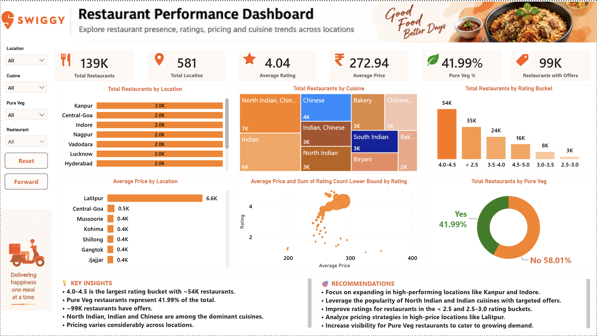
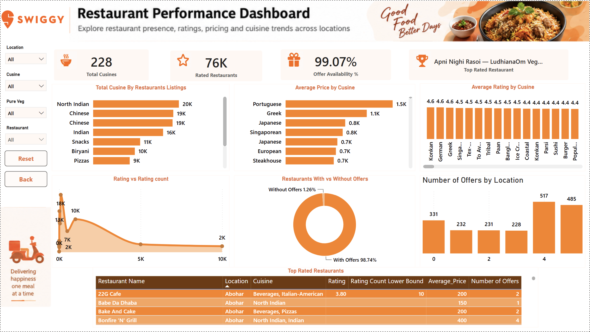

# 🍽️ Swiggy Restaurant Analytics — Power BI Dashboard

An interactive **Power BI restaurant analytics project** built from a Swiggy restaurant dataset containing **140,657 records across 581 locations**.

The dashboard is designed as a two-page analytical story: the first page provides an overall restaurant-market view, while the second page drills into **cuisine, ratings, pricing, offers, and top-rated restaurants**.

---

## 📌 Project Overview

This project demonstrates an end-to-end data analytics workflow:

```text
Raw Swiggy Dataset
        ↓
Data Understanding
        ↓
Data Cleaning & Transformation
        ↓
Power Query
        ↓
Data Modelling
        ↓
DAX Measures
        ↓
KPI Development
        ↓
Interactive Visualizations
        ↓
Business Insights
```

The analysis focuses on:

- Restaurant distribution by location
- Cuisine availability and concentration
- Rating distribution
- Average pricing
- Price vs. rating patterns
- Pure Veg restaurant share
- Promotional offer availability
- Cuisine-level pricing and ratings
- Top-rated restaurant listings

---

# 🖼️ Dashboard Preview

## 🏠 Page 1 — Restaurant Overview



The first page provides a high-level view of the restaurant landscape using KPI cards, location analysis, cuisine mix, rating buckets, pricing by location, price-vs-rating analysis, Pure Veg distribution, key insights, and recommendations.

### KPI Cards

| KPI | Dashboard Value |
|---|---:|
| 🍴 Total Restaurants | **139K** |
| 📍 Total Locations | **581** |
| ⭐ Average Rating | **4.04** |
| ₹ Average Price | **₹272.94** |
| 🌿 Pure Veg % | **41.99%** |
| 🏷️ Restaurants with Offers | **99K** |

### Main Visuals

**Restaurants by Location**  
Shows the distribution of restaurant listings across locations such as Kanpur, Central-Goa, Indore, Nagpur, Vadodara, Lucknow, Hyderabad and Jaipur.

**Restaurants by Cuisine**  
A treemap highlights frequently occurring cuisine groups, including North Indian, Indian, Chinese, Bakery, South Indian and Biryani.

**Restaurants by Rating Bucket**  
Ratings are grouped into:

```text
< 2.5
2.5 – 3.0
3.0 – 3.5
3.5 – 4.0
4.0 – 4.5
4.5 – 5.0
```

The dashboard shows the **4.0–4.5 bucket as the largest**, at approximately **54K records**.

**Average Price by Location**  
Compares average restaurant pricing across locations. Lalitpur is visibly higher than the other locations shown in the dashboard and is therefore a useful point for further investigation.

**Average Price vs Rating**  
Uses a scatter/bubble chart to explore the relationship between average price and restaurant rating, while incorporating rating-count information.

**Pure Veg Distribution**  
Shows approximately:

- 🌿 Pure Veg — **41.99%**
- 🍽️ Non-Pure Veg — **58.01%**

### Key Insights Shown on the Dashboard

- The 4.0–4.5 rating bucket contains approximately 54K restaurants.
- Pure Veg restaurants represent 41.99% of the dashboard total.
- Around 99K restaurants are shown with offers.
- North Indian, Indian and Chinese are among the prominent cuisine groups.
- Average pricing varies considerably across locations.

### Recommendations Shown on the Dashboard

- Investigate high-performing/high-density locations such as Kanpur and Indore.
- Use cuisine-level demand patterns when designing targeted offers.
- Examine lower-rated restaurant segments for potential service-quality improvement.
- Investigate pricing differences in high-price locations such as Lalitpur.
- Analyse the Pure Veg segment separately for targeted visibility and promotions.

---

## 🍜 Page 2 — Cuisine, Ratings & Offers Analysis



The second page moves from the overall market view into more detailed **cuisine, rating and promotional analysis**.

### KPI Cards

| KPI | Dashboard Value |
|---|---:|
| 🍜 Total Cuisines | **228** |
| ⭐ Rated Restaurants | **76K** |
| 🎁 Offer Availability % | **99.07%** |
| 🏆 Top Rated Restaurant | **Dynamic / filter dependent** |

### Main Visuals

**Top Cuisines by Restaurant Listings**  
Highlights cuisine categories with high restaurant presence. The dashboard shows categories such as North Indian, Chinese, Indian, Snacks, Biryani and Pizzas.

**Average Price by Cuisine**  
Compares average restaurant pricing across cuisine categories. Portuguese, Greek, Japanese, Singaporean, European and Steakhouse appear among the higher-priced categories shown.

**Average Rating by Cuisine**  
Compares average ratings across cuisine categories, with several displayed categories around the **4.4–4.6** range.

**Rating vs Rating Count**  
Examines how restaurant ratings relate to rating-count information. This is useful because a rating supported by more customer ratings provides different context from a similar rating with limited rating volume.

**Restaurants With vs Without Offers**  
Shows:

- 🎁 With Offers — **98.74%**
- ❌ Without Offers — **1.26%**

**Number of Offers by Location**  
Compares the number of promotional offers across locations.

**Top Rated Restaurants Table**  
Provides restaurant-level detail including:

- Restaurant Name
- Location
- Cuisine
- Rating
- Rating Count Lower Bound
- Average Price
- Number of Offers

This allows the user to move from aggregated analysis into individual restaurant records.

---

# 📂 Dataset

The uploaded source dataset is:

```text
Swiggy_Dataset.csv
```

### Dataset Profile

| Attribute | Value |
|---|---:|
| Records | **140,657** |
| Columns | **10** |
| Unique Restaurants | **100,665** |
| Unique Locations | **581** |
| Unique Cuisine Values | **2133** |
| Pure Veg share in raw data | **42.06%** |
| Records with Number of Offers > 0 | **98.71%** |
| Raw average rating | **4.04** |
| Raw average price | **₹270.08** |

> Dashboard KPI values can differ from raw-data profiling because the Power BI model may use distinct counts, filters, transformations, rating eligibility rules, or other business definitions.

### Source Columns

| Column | Description |
|---|---|
| `Restaurant Name` | Restaurant listing name |
| `Cuisine` | Cuisine or cuisine combination |
| `Rating` | Restaurant rating |
| `Number of Ratings` | Rating/review-count information |
| `Average Price` | Approximate average price |
| `Number of Offers` | Number of offers |
| `Offer Name` | Promotional offer information |
| `Area` | Restaurant operating area |
| `Pure Veg` | Pure vegetarian indicator |
| `Location` | Restaurant city/location |

---

# 🧹 Data Cleaning & Transformation

The raw CSV was prepared for analysis before building the dashboard.

### Key preparation steps

- Reviewed missing and inconsistent values.
- Converted fields to appropriate data types.
- Cleaned the `Average Price` field for numerical analysis.
- Prepared `Rating` for numerical calculations.
- Prepared `Number of Ratings` for rating-count analysis.
- Standardised categorical fields such as `Pure Veg` and `Location`.
- Created rating buckets used in the dashboard.
- Prepared cuisine information for aggregation.
- Created measures and calculated fields required for the visuals.

### Missing Values in the Source File

The uploaded CSV contains:

| Field | Missing Records |
|---|---:|
| `Number of Ratings` | **14,542** |
| `Offer Name` | **1,808** |
| `Cuisine` | **27** |
| `Area` | **2** |

The remaining listed source fields contain no missing values.

---

# 🧮 Power BI & DAX

The project uses DAX for KPI calculations, aggregation and interactive analysis.

Examples:

```DAX
Total Restaurants =
DISTINCTCOUNT('Swiggy'[Restaurant Name])
```

```DAX
Total Locations =
DISTINCTCOUNT('Swiggy'[Location])
```

```DAX
Average Rating =
AVERAGE('Swiggy'[Rating])
```

```DAX
Average Price =
AVERAGE('Swiggy'[Average Price])
```

Additional calculations support:

- Pure Veg %
- Offer Availability %
- Rated Restaurants
- Total Cuisines
- Rating Buckets
- Rating Count Lower Bound
- Restaurant-level metrics
- Dynamic Top Rated Restaurant logic

> Exact measure names can vary depending on the final Power BI model.

---

# 🎛️ Interactive Features

The dashboard provides slicers for:

- 📍 **Location**
- 🍜 **Cuisine**
- 🌿 **Pure Veg**
- 🏪 **Restaurant**

Navigation controls include:

- **Reset** — clears selected filters.
- **Forward** — moves from the overview page to the detailed page.
- **Back** — returns to the previous page.

The visuals update according to the selected filters, enabling both high-level and restaurant-level exploration.

---

# 💡 Business Insights

The dashboard supports several analytical observations:

### Restaurant Coverage
The source dataset contains **140,657 restaurant records across 581 locations**, providing broad geographical coverage.

### Rating Distribution
The **4.0–4.5** rating bucket is the largest category shown on the overview page, at approximately **54K records**.

### Cuisine Presence
North Indian, Chinese and Indian-related cuisine categories have substantial representation in the dashboard.

### Pricing Variation
Restaurant pricing varies noticeably across locations and cuisines. Lalitpur is a visible high-price outlier in the location-level chart.

### Pure Veg Segment
Pure Veg restaurants account for **41.99%** in the dashboard, creating a sizeable segment for separate analysis.

### Offers
The detailed dashboard shows **98.74% of restaurants with offers** and **1.26% without offers** in its offer-availability visual.

### Rating Context
The rating-vs-rating-count analysis highlights why rating should be interpreted together with the volume of customer ratings rather than in isolation.

---

# 🎯 Business Recommendations

Based on the dashboard analysis, the project can be extended into the following business questions:

1. **Location strategy**  
   Investigate locations with high restaurant concentration and compare supply, pricing, cuisine mix and rating quality.

2. **Cuisine strategy**  
   Segment promotions and restaurant discovery by cuisine instead of applying a single strategy across all categories.

3. **Rating improvement**  
   Drill into lower-rating segments to identify restaurant-level patterns and potential service-quality opportunities.

4. **Pricing analysis**  
   Investigate unusually high or low average prices by location and cuisine before making commercial decisions.

5. **Offer effectiveness**  
   Move beyond offer availability and analyse whether offers are associated with higher ratings, restaurant visibility or other measurable outcomes.

6. **Pure Veg segmentation**  
   Treat Pure Veg restaurants as a distinct segment and compare their pricing, ratings, locations and cuisine combinations.

---

# 🛠️ Technology Stack

### Microsoft Power BI
- Dashboard development
- Data modelling
- KPI cards
- Interactive visualisations
- Slicers
- Page navigation
- Business storytelling

### Power Query
- Data cleaning
- Data transformation
- Data type conversion
- Text preparation
- Missing-value review

### DAX
- KPI measures
- Distinct counts
- Averages
- Percentages
- Conditional calculations
- Dynamic metrics

### CSV
Primary source data format.

---

# 📁 Suggested Repository Structure

```text
swiggy-restaurant-analysis/
│
├── Dashboard/
│   └── Swiggy_Dashboard.pbix
│
├── Dataset/
│   └── Swiggy_Dataset.csv
│
├── Screenshots/
│   ├── Restaurant_Overview.png
│   └── Cuisine_Ratings_Offers.png
│
└── README.md
```

---

# 💼 Skills Demonstrated

`Power BI` · `Power Query` · `DAX` · `Data Cleaning` · `Data Transformation` · `Data Analysis` · `Data Visualization` · `KPI Design` · `Interactive Dashboard Development` · `Business Intelligence` · `Data Storytelling`

---

# 🚀 How to Use

### 1. Clone the repository

```bash
git clone <your-repository-url>
```

### 2. Open the project

Open:

```text
Dashboard/Swiggy_Dashboard.pbix
```

using **Microsoft Power BI Desktop**.

### 3. Explore the dashboard

Use the slicers and navigation buttons to analyse:

- Locations
- Cuisines
- Pure Veg status
- Restaurants
- Ratings
- Pricing
- Offers

---

# 👩‍💻 Author

## Sheena Charaya

**Data Analytics | Power BI | SQL | Excel | Python**

📧 **Email:** [sheena.charaya@gmail.com](mailto:sheena.charaya@gmail.com)

🔗 **[LinkedIn](https://www.linkedin.com/in/sheena-charaya/)**

---

## ⭐ Project Summary

This project demonstrates how a large restaurant dataset can be transformed into an interactive business intelligence solution.

The final dashboard combines:

```text
140K+ Source Records
        ↓
Data Preparation
        ↓
Power Query
        ↓
DAX Measures
        ↓
KPI Analysis
        ↓
Location & Cuisine Analysis
        ↓
Rating & Pricing Analysis
        ↓
Offer Analysis
        ↓
Business Insights
```

The result is a **two-page Power BI dashboard** that moves from an overall restaurant landscape to detailed cuisine, rating, pricing, offer and restaurant-level analysis.
